##** Brickwork Application **
- 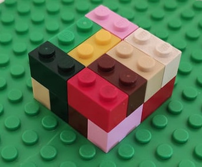

The console application accepts two parameters:
* n , m — dimensions of the area;
* the next n lines following column M describing the bricks layout in the first layer.
NOTE: Each brick is marked with two equal numbers written in the squares of the
area that are covered by this brick. All bricks are marked with whole numbers ranging from 1 to the total number of the bricks. M and N are even numbers not
exceeding 100.

The program calculates if a second layer of bricks can be made. If a second layer cannot be built, it prints -1.
**************************
Sample inputs and outputs:

_Input:_

_Output:_

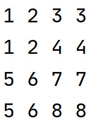

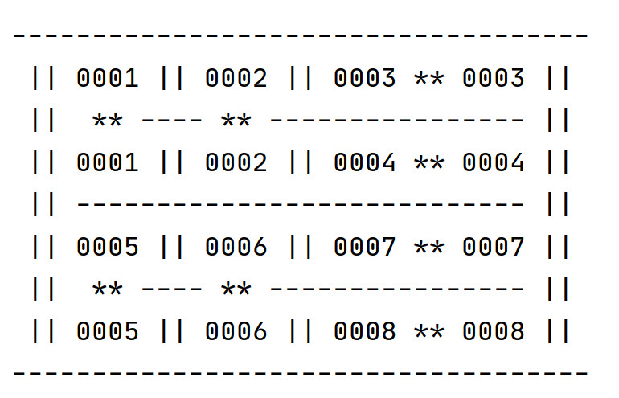

_Input:_

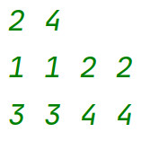

_Output:_

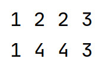

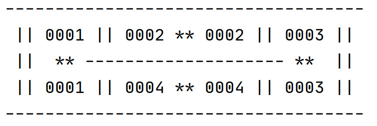

_Input:_

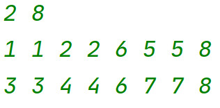

_Output:_

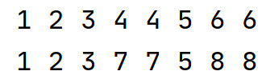

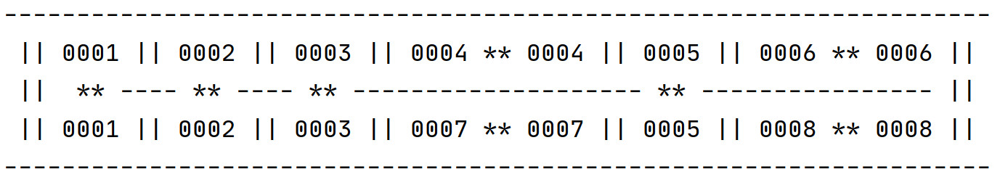

_Input:_

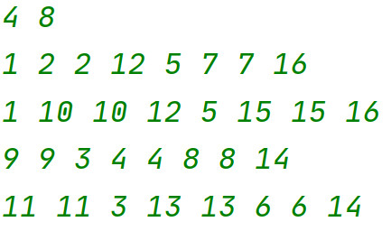

_Output:_

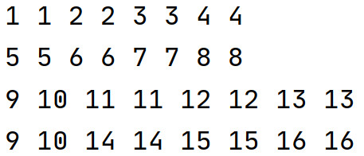

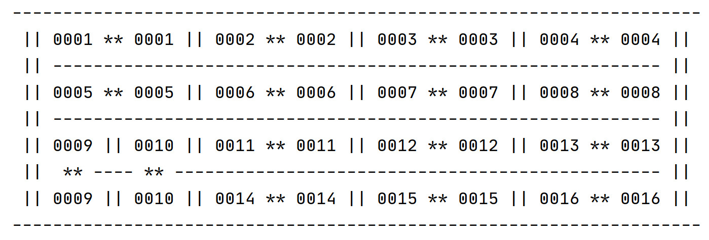

_Input:_

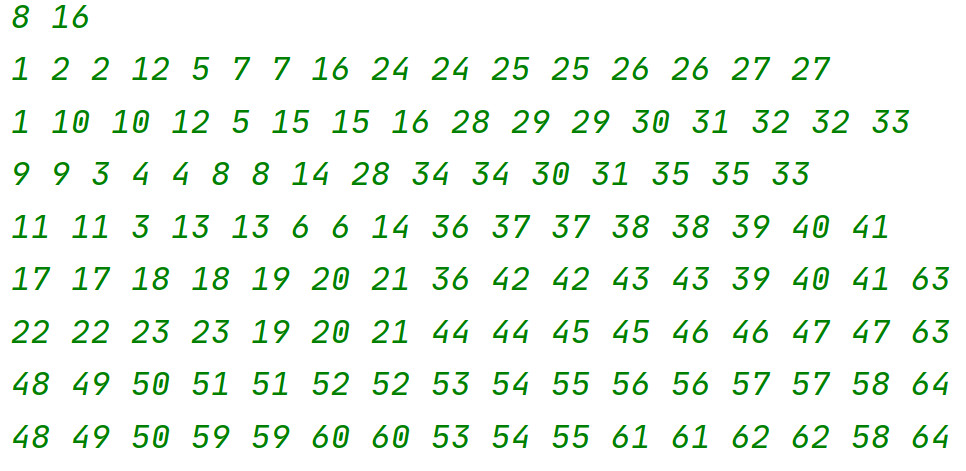

_Output:_

-1

A solution is not found.

_Input:_

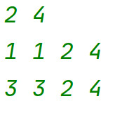

_Output:_

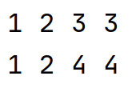

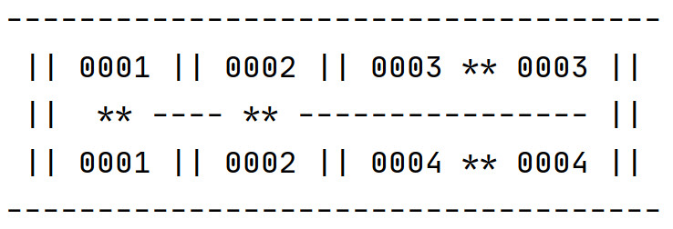

_Input:_

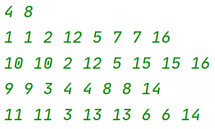

_Output:_

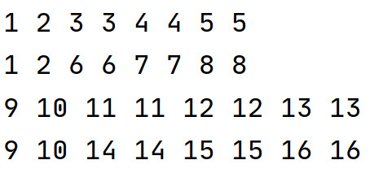

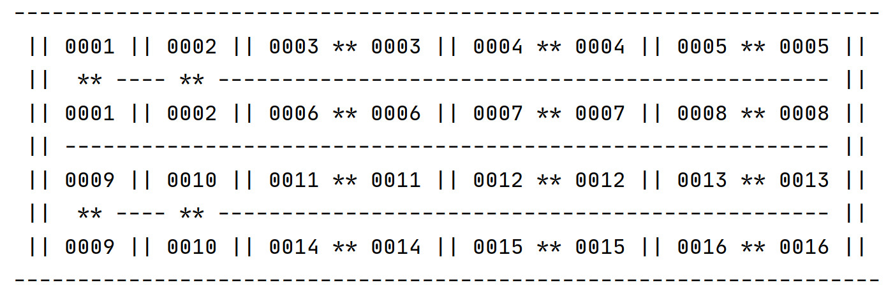

_Input:_

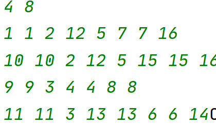

_Output:_

Column length should be equal to m.

_Input:_

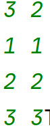

_Output:_

The wall thickness/width and length (n and m) should be even numbers.

_Input:_

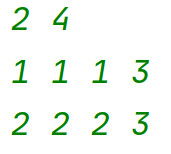

_Output:_

Bricks should be made of maximum 2 plates.
